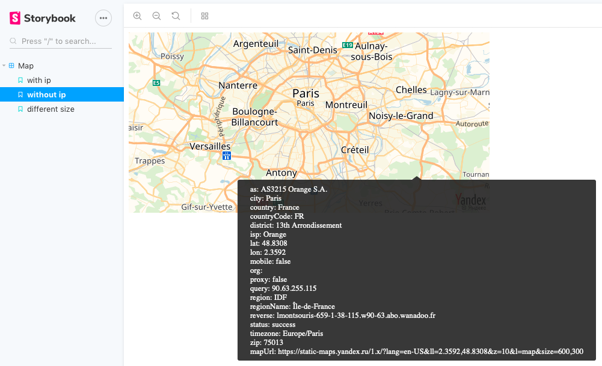

[](https://www.npmjs.com/package/ip-map-react)

# Ip Map React

React component to display ip location on a map 🗺.

## Screenshot



# Installation and usage

The easiest way to use react-select is to install it from npm and build it into your app.

```
npm install ip-map-react --save
```

Then use it in your app:

```js
import React from "react";
import Map from "ip-map-react";

class App extends React.Component {
  render() {
    return <Map ip="8.8.8.8" width="400" height="400" />;
  }
}
```

## Props

Common props you may want to specify include:

- `ip` - IP to locate (By default, the user IP will be used)
- `width` - Width of the map (default: 600px)
- `height` - Height of the map (default: 300px)

## Developpers

Clone the project and start Storybook.

```sh
git clone https://github.com/funkyremi/ip-map-react
cd ip-map-react
npm install
npm run storybook
```

## License

MIT
